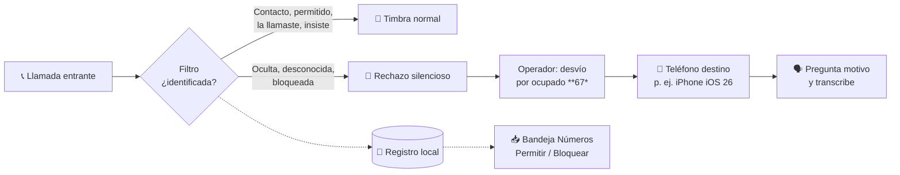

# 🛡️ Filtro — llamadas no identificadas, sin espías

**Filtro** es una app Android libre y gratuita que **silencia las llamadas de números desconocidos u ocultos**
y hace que tu operador las **desvíe a otro teléfono** (por ejemplo un iPhone con iOS 26 que contesta,
pregunta el motivo y transcribe), dejando un **registro local** de cada llamada.

- ✅ **Sin root** — usa APIs públicas de Android (`CallScreeningService`).
- ✅ **Sin Internet** — la app **no tiene permiso de red**. Tus contactos y tu registro nunca salen del teléfono.
- ✅ **Sin servidores, sin cuentas, sin publicidad, sin rastreo.**
- ✅ Código abierto bajo licencia **MIT**.

> *English summary:* Filtro is a free, open-source Android app that silently rejects calls from unknown or
> hidden numbers so your carrier forwards them (conditional call forwarding on busy, `**67*`) to another phone —
> e.g. an iPhone running iOS 26 Call Screening. No root, **no INTERNET permission**, no accounts, local log only.

---

## ¿Por qué existe?

Las apps anti-spam populares suelen **subir tu agenda de contactos** a sus servidores para funcionar.
Filtro toma el camino opuesto: todas las decisiones se toman **dentro del teléfono** y el trabajo de
"asistente" lo hace un equipo que ya es tuyo (p. ej. un iPhone con *Filtrar llamadas desconocidas*).

## ¿Cómo funciona?



## Funciones

| | |
|---|---|
| **Reglas configurables** | Desviar ocultos · desviar desconocidos · dejar pasar a quienes llamaste (7–90 días) · dejar pasar si insiste (2–10 min) |
| **Bandeja "Números"** | Los desconocidos desviados agrupados por número con sus intentos: **Permitir** o **Bloquear** con un toque (con deshacer), "Bloquear insistentes" y "Marcar todo revisado" |
| **Permitidos / Bloqueados** | Siempre timbran / siempre se desvían (ni insistiendo pasan) |
| **Redirección** | Activar / verificar / desactivar el desvío del operador desde la app, por la SIM elegida |
| **Registro** | Historial por día, búsqueda, filtros, notas, permitir/bloquear desde el detalle, exportar CSV |
| **Doble SIM** | Proteger todas las líneas o solo una |
| **Notificaciones** | Un solo aviso con el total de desviadas del día (suena solo la primera vez) |
| **Diseño** | Material 3, tema claro/oscuro, colores dinámicos |

## Requisitos

- Android **10 o superior** (probado en Android 16).
- Un operador que soporte **desvío condicional por ocupado** (`**67*número#`) — estándar GSM.
- Un **teléfono destino** con su propia línea (recomendado: iPhone con iOS 26 y *Filtrar llamadas desconocidas → Preguntar motivo*),
  o cualquier número que atienda llamadas (buzón, número virtual).

## Instalación rápida

1. Descarga el APK desde **[Releases](../../releases)** o compílalo (ver abajo).
2. Instálalo, abre **Filtro** y completa la *Configuración pendiente* en Inicio.
3. **Ajustes → Destino**: número del teléfono destino → Guardar.
4. **Inicio → Redirección → Activar** (marca el código del operador).
5. Enciende **Protección activa**. Listo: funciona en segundo plano, sin abrir la app.
6. De vez en cuando abre **Números → Revisar**: permite a quien reconozcas y bloquea a los insistentes.

👉 Guía completa: **[Manual de usuario](docs/MANUAL_USUARIO.md)**

## Compilar desde el código

```bash
git clone https://github.com/NormanEn1/FiltroLlamadas.git
cd FiltroLlamadas
./gradlew assembleDebug        # Windows: gradlew.bat assembleDebug
# APK: app/build/outputs/apk/debug/app-debug.apk
```

O ábrelo en **Android Studio** (Quail o superior) y pulsa ▶ Run.
Detalles, versiones y firma de releases: **[Manual técnico](docs/MANUAL_TECNICO.md)**

## Documentación

| Documento | Contenido |
|---|---|
| [Arquitectura](docs/ARQUITECTURA.md) | Diagramas, componentes, flujo de una llamada, modelo de datos, decisiones de diseño |
| [Manual de usuario](docs/MANUAL_USUARIO.md) | Configuración paso a paso, uso diario, preguntas frecuentes, solución de problemas |
| [Manual técnico](docs/MANUAL_TECNICO.md) | Entorno, compilación, estructura del código, reglas, pruebas, publicación |
| [Privacidad](PRIVACY.md) | Qué datos usa la app y por qué (spoiler: nada sale del teléfono) |
| [Seguridad](SECURITY.md) | Cómo reportar vulnerabilidades |
| [Contribuir](CONTRIBUTING.md) | Cómo proponer cambios |
| [Cambios](CHANGELOG.md) | Historial de versiones |

## Limitaciones conocidas

- Android **no permite** a apps normales contestar la llamada ni hablar dentro de ella; por eso el "asistente"
  es el teléfono destino. (Eso requiere permisos de sistema/root.)
- El desvío depende del **operador**: su costo, disponibilidad y si conserva el número original de quien llama.
- Si rechazas manualmente una llamada de un contacto, también se desvía (es un desvío "por ocupado").
- Un número desconocido que remarca enseguida timbra (regla *insiste*) hasta que lo **bloquees** en la bandeja.
- La app no puede leer el estado real del desvío; muestra la última acción marcada (usa *Verificar*).

## Aviso legal

Filtro se ofrece **"tal cual", sin garantía** (ver [LICENSE](LICENSE)). Los cargos del operador por desvío de
llamadas son responsabilidad del usuario. Si el teléfono destino graba o transcribe llamadas, informa a quien
llama conforme a la normativa aplicable (en Colombia, Ley 1581 de 2012 de protección de datos personales).

---

**Filtro 1.0.0 (2026)** · por **Neom** · Hecho con ❤️ en Colombia · Licencia [MIT](LICENSE)
