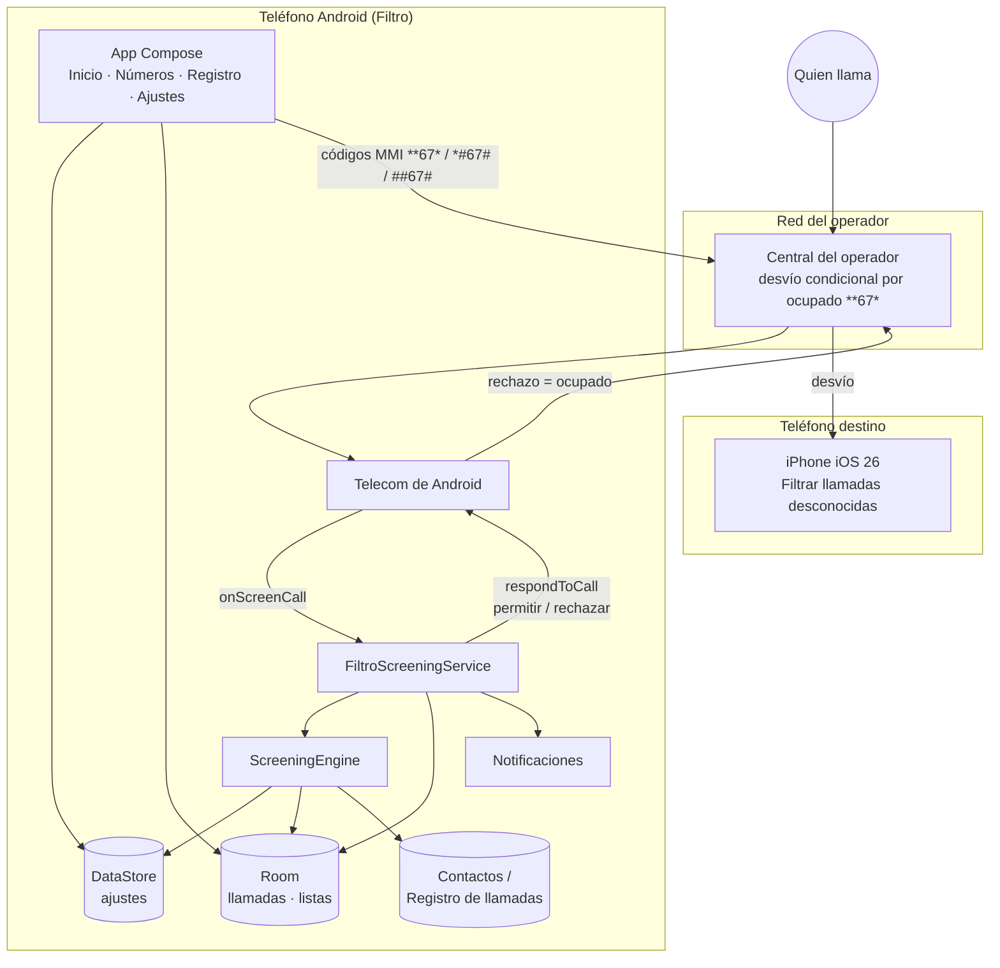
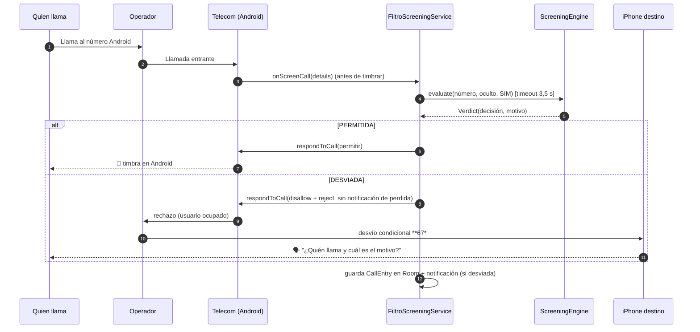
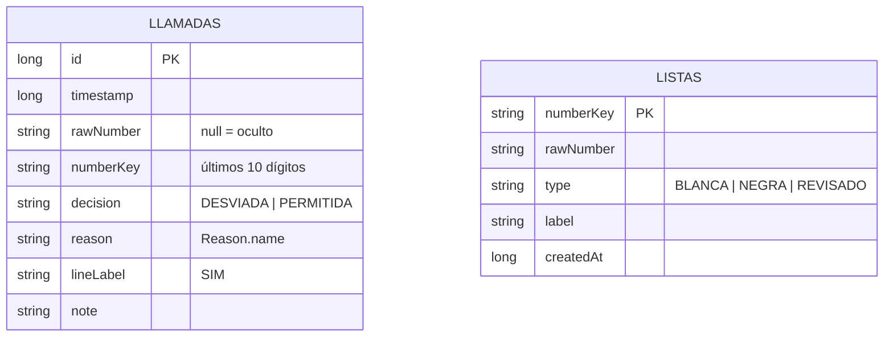

# Arquitectura — Filtro

> Versión 1.0.0 · Documento vivo: actualízalo cuando cambie el diseño.

## 1. Contexto y restricciones

| Restricción | Consecuencia en el diseño |
|---|---|
| Sin root (el usuario usa apps bancarias) | Solo APIs públicas. No se puede contestar ni inyectar audio en la llamada (`CALL_AUDIO_INTERCEPTION` es de sistema). |
| Privacidad total | La app **no declara `INTERNET`** (y lo elimina explícitamente del manifiesto fusionado). Todo se decide localmente. |
| Experiencia tipo iPhone *Call Screening* | Se delega en un **teléfono destino** que sí lo tiene; Filtro solo decide y enruta. |
| Cualquier Android ≥ 10 | `CallScreeningService` + `RoleManager.ROLE_CALL_SCREENING` (API 29). |

## 2. Vista de sistema

## 3. Flujo de una llamada

**Principio de seguridad:** ante cualquier excepción o si la evaluación supera 3,5 s (Android concede ~5 s),
la respuesta es **permitir**. Nunca se pierde una llamada por un fallo de la app.

## 4. Motor de reglas

Evaluación en orden; la primera regla que aplica decide.

```mermaid
flowchart TD
    S([Llamada]) --> A{¿Filtro encendido?} -- No --> P0[PERMITIR · FILTRO_APAGADO]
    A -- Sí --> B{¿Destino configurado?} -- No --> P1[PERMITIR · SIN_DESTINO]
    B -- Sí --> C{¿SIM protegida?} -- No --> P2[PERMITIR · LINEA_NO_PROTEGIDA]
    C -- Sí --> D{¿Número oculto?} -- Sí --> D1{divertHidden} -- Sí --> X1[DESVIAR · OCULTO]
    D1 -- No --> P3[PERMITIR · OCULTO]
    D -- No --> E{¿Emergencia?} -- Sí --> P4[PERMITIR · EMERGENCIA]
    E -- No --> F{¿≤ 6 dígitos?} -- Sí --> P5[PERMITIR · CODIGO_CORTO]
    F -- No --> G{¿Bloqueado?} -- Sí --> X2[DESVIAR · LISTA_NEGRA]
    G -- No --> H{¿En contactos?} -- Sí --> P6[PERMITIR · CONTACTO]
    H -- No --> I{¿Permitido?} -- Sí --> P7[PERMITIR · LISTA_BLANCA]
    I -- No --> J{¿Lo llamé en N días?} -- Sí --> P8[PERMITIR · LLAMADA_RECIENTE]
    J -- No --> K{¿Desviado hace < N min?} -- Sí --> P9[PERMITIR · RELLAMADA]
    K -- No --> L{divertUnknown} -- Sí --> X3[DESVIAR · DESCONOCIDO]
    L -- No --> P10[PERMITIR · DESCONOCIDO]
```

Notas:
- **Bloqueado** se evalúa antes que *contactos* y que *insiste*: un número bloqueado nunca timbra.
- **Permitido** se evalúa después de *bloqueado*: si un número estuviera en ambas (no ocurre, la clave es única), gana el bloqueo.
- Un número marcado **REVISADO** sigue el camino normal de un desconocido.
- En la interfaz, `LISTA_BLANCA`/`LISTA_NEGRA` se muestran como *Número permitido* / *Número bloqueado*.

Comparación de números: se normaliza a **dígitos** y se usan los **últimos 10** (`PhoneNumbers.key`), así
`+57 300 123 4567`, `573001234567` y `300-123-4567` son el mismo número. Para contactos se usa
`ContactsContract.PhoneLookup`, que aplica la normalización propia de Android.

## 5. Componentes

| Capa | Componente | Responsabilidad |
|---|---|---|
| Sistema | `FiltroScreeningService` | Punto de entrada. Recibe la llamada, pide veredicto, responde a Telecom, registra y notifica. |
| Dominio | `ScreeningEngine` | Reglas de decisión, 100 % local. |
| Dominio | `Model.kt` | `Decision`, `Reason`, `Verdict`, `ListType`, `PhoneNumbers`. |
| Datos | `SettingsRepository` (DataStore) | Ajustes persistentes y reactivos (`Flow<AppSettings>`). |
| Datos | `AppDatabase` (Room) | Tablas `llamadas` (registro) y `listas` (permitidos, bloqueados, revisados); consulta agregada para la bandeja. |
| Datos | `AppContainer` | Inyección manual de dependencias + `appScope` (IO). |
| Telefonía | `Telefonia` | Enumerar SIMs (`PhoneAccountHandle`) y marcar códigos MMI con `TelecomManager.placeCall`. |
| Presentación | `ui/*` (Compose M3) | 4 pantallas (Inicio, Números, Registro, Ajustes) con ViewModel + `StateFlow`; navegación inferior con contador de pendientes. |
| Soporte | `Notifier`, `CsvExporter` | Notificación resumen del día; exportación CSV (UTF-8 BOM). |

## 6. Modelo de datos

Ajustes (DataStore `ajustes`): `enabled`, `destinationNumber`, `destinationLabel`, `useCountryPrefix`,
`lineId/lineComponent/lineLabel`, `divertHidden`, `divertUnknown`, `recentDays`, `allowRepeat`, `repeatMinutes`,
`notifyOnDivert`, `retentionDays`, `themeMode`, `dynamicColor`, `forwardingState/Target/At`.

**Bandeja "Revisar"** (vistas derivadas, sin tabla propia), sobre llamadas `DESVIADA` con número, agrupadas por
`numberKey` (`COUNT`, `MAX(timestamp)`):

- **Pendientes** = número sin entrada en `listas`, **o** `REVISADO` cuya última llamada es posterior a `createdAt`
  (volvió a llamar después de revisarlo).
- **Revisados** = `REVISADO` sin llamadas posteriores a `createdAt`.
- Permitir / Bloquear hace *upsert* `BLANCA` / `NEGRA` (reemplaza `REVISADO`). *Deshacer* borra la entrada y, si
  venía de Revisados, la restaura como `REVISADO`. *Volver a pendientes* borra la entrada `REVISADO`.

`REVISADO` no altera la decisión: el motor solo evalúa `BLANCA` y `NEGRA`.

Notificación: una única notificación (id fijo) con el total de desviadas del día y `setOnlyAlertOnce`.

Retención: al iniciar la app y al cambiar el ajuste se borran registros más antiguos que `retentionDays`.

## 7. Permisos

| Permiso | Uso | ¿Obligatorio? |
|---|---|---|
| Rol `CALL_SCREENING` | Recibir `onScreenCall` | Sí |
| `READ_CONTACTS` | Saber si el número es contacto | Sí |
| `READ_CALL_LOG` | Regla "lo llamaste en N días" | No |
| `READ_PHONE_STATE` | Listar SIMs | No |
| `CALL_PHONE` | Marcar códigos de desvío | No (puede marcarse a mano) |
| `POST_NOTIFICATIONS` | Aviso resumen de desvíos | No |
| ~~`INTERNET`~~ | **Eliminado** con `tools:node="remove"` | — |

## 8. Decisiones de diseño (ADR resumidos)

| # | Decisión | Alternativas descartadas | Motivo |
|---|---|---|---|
| 1 | Rechazar + desvío del operador | Contestar en Android e interceptar audio | Requiere permisos de sistema/root. |
| 2 | Destino = otro teléfono (iPhone iOS 26) | Servidor propio con Asterisk + Whisper | Costo cero y privacidad; el servidor queda como evolución. |
| 3 | Sin permiso `INTERNET` | Sincronización / listas de spam en la nube | Garantía técnica (no solo política) de privacidad. |
| 4 | Room + DataStore | SQLite manual / SharedPreferences | Reactividad con Flow y menos código. |
| 5 | DI manual (`AppContainer`) | Hilt | App pequeña; menos dependencias y tiempo de compilación. |
| 6 | Permitir ante error/timeout | Desviar por defecto | Nunca perder una llamada legítima. |
| 7 | Bandeja "Revisar" agrupada por número | Solo registro cronológico + listas manuales | Con 20+ spam/día el registro es ruido; clasificar por número con un toque es más rápido y cierra el hueco de la regla *insiste*. |
| 8 | Bandeja derivada (consulta), no tabla | Tabla de pendientes sincronizada | Sin migraciones ni riesgo de desincronización. |
| 9 | Una notificación resumen | Una notificación por llamada | Evita 20 interrupciones al día. |

## 9. Evolución prevista

- **Destino número virtual** (+57) con servidor propio: saludo, grabación, transcripción (Whisper) y entrega por
  Telegram/correo. Filtro no cambia (el destino es solo un número).
- Desvío adicional por falta de cobertura (`**62*`).
- Pruebas unitarias del motor de reglas y CI con APK firmado en *Releases*.
